# NHS HomeTest Management Terraform

Infrastructure as Code (IaC) for the NHS HomeTest Service using Terraform and Terragrunt for multi-environment, multi-account AWS deployments.

## Table of Contents

- [NHS HomeTest Management Terraform](#nhs-hometest-management-terraform)
  - [Table of Contents](#table-of-contents)
  - [Overview](#overview)
  - [Architecture](#architecture)
    - [Cloud Resources](#cloud-resources)
  - [Prerequisites](#prerequisites)
  - [AWS SSO Setup](#aws-sso-setup)
  - [Getting Started](#getting-started)
  - [Infrastructure Components](#infrastructure-components)
    - [Key Directories](#key-directories)
  - [Deployment](#deployment)
    - [Quick Deploy](#quick-deploy)
    - [Deploy All](#deploy-all)
  - [Environments](#environments)
  - [Development Tools](#development-tools)
    - [Pre-commit Hooks](#pre-commit-hooks)
    - [Mise Tasks](#mise-tasks)
    - [Testing](#testing)
  - [Documentation](#documentation)
    - [External Resources](#external-resources)
  - [Licence](#licence)

## Overview

This repository manages the AWS infrastructure for the NHS HomeTest Service, including:

- **Bootstrap** — Terraform state backend (S3 + KMS) and GitHub OIDC for CI/CD
- **Networking** — VPC, subnets, NAT gateways, Network Firewall, VPC endpoints, Route53 with DNSSEC
- **Shared Services** — WAF, ACM certificates, KMS, Cognito, IAM roles, SNS alerts, Secrets Manager
- **Aurora PostgreSQL** — Serverless v2 database with Goose migrations
- **ECS Cluster** — Fargate cluster with shared ALB for WireMock and container workloads
- **HomeTest Application** — Lambda functions, API Gateway, CloudFront + S3 SPA, SQS queues, WireMock

## Architecture

### Cloud Resources

```mermaid
graph TB
    classDef aws fill:#FF9900,stroke:#232F3E,color:#232F3E,font-weight:bold
    classDef network fill:#8C4FFF,stroke:#232F3E,color:#fff
    classDef security fill:#DD344C,stroke:#232F3E,color:#fff
    classDef compute fill:#ED7100,stroke:#232F3E,color:#fff
    classDef storage fill:#3B48CC,stroke:#232F3E,color:#fff
    classDef database fill:#3B48CC,stroke:#232F3E,color:#fff
    classDef cdn fill:#8C4FFF,stroke:#232F3E,color:#fff
    classDef messaging fill:#E7157B,stroke:#232F3E,color:#fff
    classDef identity fill:#DD344C,stroke:#232F3E,color:#fff
    classDef mgmt fill:#E7157B,stroke:#232F3E,color:#fff
    classDef container fill:#ED7100,stroke:#232F3E,color:#fff

    USER["👤 User<br/>{env}.poc.hometest.service.nhs.uk"]

    subgraph AWS["☁️ AWS Account (poc: 781863586270 / dev: 781195019563) — eu-west-2"]
        subgraph BOOTSTRAP["🔧 Bootstrap (deployed once)"]
            S3STATE["📦 S3<br/>Terraform State"]:::storage
            KMSSTATE["🔐 KMS<br/>State Encryption"]:::security
            OIDC["🔑 GitHub OIDC<br/>IAM Role"]:::identity
        end

        subgraph EDGE["🌐 Edge Services"]
            R53["🌍 Route53<br/>hometest.service.nhs.uk<br/>DNSSEC + DNS Query Logging"]:::network
            WAFCF["🛡️ WAF<br/>CloudFront"]:::security
            WAFAPIGW["🛡️ WAF<br/>API Gateway / ALB"]:::security
            ACM["📜 ACM<br/>*.poc.hometest.service.nhs.uk"]:::security
        end

        subgraph VPC["🔒 VPC 10.0.0.0/16"]
            subgraph PUBSUB["Public Subnets"]
                NAT["🔀 NAT Gateway"]:::network
                NFW["🧱 Network Firewall<br/>Domain + IP Filtering"]:::security
                ALB["🔀 ALB<br/>Shared (ECS)"]:::network
            end

            subgraph PRIVSUB["Private Subnets"]
                subgraph ENV_DEV["📦 Per-Environment (dev, uat, demo, prod)"]
                    CF["☁️ CloudFront<br/>+ S3 SPA (Next.js)"]:::cdn
                    APIGW["🔌 API Gateway<br/>REST API v1"]:::compute
                    L1["λ eligibility-lookup"]:::compute
                    L2["λ login"]:::compute
                    L3["λ session"]:::compute
                    L4["λ order-service"]:::compute
                    L5["λ get-order"]:::compute
                    L6["λ order-router<br/>(SQS-triggered)"]:::compute
                    L7["λ order-result"]:::compute
                    L8["λ get-results"]:::compute
                    L9["λ order-status"]:::compute
                    L10["λ postcode-lookup"]:::compute
                    SQS1["📨 SQS<br/>order-placement"]:::messaging
                    SQS2["📨 SQS<br/>notify-messages"]:::messaging
                    SQS3["📨 SQS<br/>order-results"]:::messaging
                    SQS4["📨 SQS FIFO<br/>notifications"]:::messaging
                    WM["🐳 WireMock<br/>ECS Fargate<br/>(optional)"]:::container
                end

                VPCE["🔗 VPC Endpoints<br/>S3, Lambda, SecretsManager,<br/>SQS, KMS, CloudWatch, ECR"]:::network
            end

            subgraph DATASUB["Data Subnets (isolated)"]
                RDS["🐘 Aurora PostgreSQL<br/>Serverless v2"]:::database
            end
        end

        subgraph SHARED["🔐 Shared Services"]
            KMS["🔑 KMS<br/>main + pii_data keys"]:::security
            COGNITO["👥 Cognito<br/>User Pool + Identity Pool"]:::identity
            IAM["👤 Developer IAM<br/>Deploy Role"]:::identity
            SM["🗝️ Secrets Manager<br/>Supplier Credentials"]:::security
            SNS["📢 SNS<br/>Alerts Topic"]:::messaging
        end

        subgraph EXTERNAL["🌐 External Services"]
            NHSLOGIN["NHS Login<br/>(sandpit / prod)"]
            OSPLACES["OS Places API<br/>(postcode lookup)"]
            SUPPLIERS["Supplier APIs<br/>(Preventex, etc.)"]
        end
    end

    USER -->|HTTPS| R53
    R53 -->|DNS| CF
    CF -->|"/* → S3 SPA"| APIGW
    CF -.->|WAF| WAFCF
    CF -.->|TLS| ACM

    APIGW -->|"/eligibility-lookup/*"| L1
    APIGW -->|"/login/*"| L2
    APIGW -->|"/session/*"| L3
    APIGW -->|"/order/* (POST)"| L4
    APIGW -->|"/get-order/* (GET)"| L5
    APIGW -->|"/result/*"| L7
    APIGW -->|"/results/* (GET)"| L8
    APIGW -->|"/test-order-status/*"| L9
    APIGW -->|"/postcode-lookup/*"| L10
    APIGW -.->|WAF| WAFAPIGW

    SQS1 -->|trigger| L6

    L1 & L5 & L7 & L8 & L9 -->|query| RDS
    L4 -->|enqueue| SQS1
    L7 & L9 -->|enqueue| SQS2
    L2 -.->|auth| NHSLOGIN
    L10 -.->|lookup| OSPLACES
    L6 -->|HTTP| SUPPLIERS
    L6 -.->|secrets| SM

    L1 & L2 & L3 & L4 & L5 & L6 & L7 & L8 & L9 & L10 -->|egress| NAT
    NAT -->|filtered| NFW
    L1 & L2 & L3 & L4 & L5 & L6 & L7 & L8 & L9 & L10 -.->|encrypt| KMS
    L1 & L2 & L3 & L4 & L5 & L6 & L7 & L8 & L9 & L10 -.->|private access| VPCE

    ALB -->|host routing| WM

    SNS -.->|alarms| SQS1 & SQS2 & SQS3 & SQS4

    OIDC -.->|"CI/CD"| S3STATE
```



## Prerequisites

The following tools are managed via [mise](https://github.com/jdx/mise) (see [.mise.toml](.mise.toml)):

| Tool | Version | Purpose |
|------|---------|---------|
| **Terraform** | 1.14.8 | Infrastructure provisioning |
| **Terragrunt** | 1.0.0 | DRY Terraform configuration |
| **AWS CLI** | 2.34.26 | AWS interaction |
| **Python** | 3.14.2 | Git hooks, scripting |
| **TFLint** | 0.61.0 | Terraform linting |
| **terraform-docs** | 0.22.0 | Auto-generated documentation |
| **Trivy** | 0.69.3 | Security scanning |
| **Checkov** | 3.2.517 | Policy-as-code scanning |
| **Gitleaks** | 8.30.1 | Secret scanning |
| **pre-commit** | 4.5.1 | Git hooks |
| **Go** | 1.26.2 | Lambda goose migrator builds |
| **goose** | 3.27.0 | Database migrations |
| **Vale** | 3.14.1 | Prose linting |

Additional requirements:

- [Docker](https://www.docker.com/) or compatible container runtime
- [GNU Make](https://www.gnu.org/software/make/) 3.82+
- [jq](https://jqlang.github.io/jq/) (JSON processing)
- Firefox with [AWS SSO Containers](https://addons.mozilla.org/en-US/firefox/addon/aws-sso-containers/) (optional, for multi-account browser management)

Install all tool versions:

```bash
mise install
```

## AWS SSO Setup

```bash
aws configure sso

# Resulting ~/.aws/config profile:
# [profile Admin-PoC]
# sso_session = nhs
# sso_account_id = 781863586270
# sso_role_name = Admin
# region = eu-west-2
#
# [sso-session nhs]
# sso_start_url = https://d-9c67018f89.awsapps.com/start/#
# sso_region = eu-west-2
# sso_registration_scopes = sso:account:access

aws sso login --profile Admin-PoC
export AWS_PROFILE=Admin-PoC
```

## Getting Started

```bash
# Clone the repository
git clone https://github.com/NHSDigital/hometest-mgmt-terraform.git
cd hometest-mgmt-terraform

# Install tool versions
mise install

# Configure pre-commit hooks and development dependencies
make config
```

## Infrastructure Components

See [infrastructure/README.md](./infrastructure/README.md) for the full infrastructure guide including:

- Directory structure and module documentation
- Deployment order and dependencies
- Security features (WAF, KMS, VPC, Network Firewall)
- Troubleshooting guide

### Key Directories

| Directory | Purpose |
|-----------|---------|
| `infrastructure/src/` | Terraform root modules (bootstrap, network, shared_services, aurora-postgres, ecs-cluster, hometest-app, lambda-goose-migrator, mock-service, rds-postgres) |
| `infrastructure/modules/` | Reusable Terraform modules (api-gateway, cloudfront-spa, lambda, lambda-iam, aurora-postgres, sqs, sns, waf, developer-iam, deployment-artifacts) |
| `infrastructure/environments/` | Terragrunt environment configurations (poc, dev accounts with core + per-env app stacks) |
| `scripts/` | Build, test, and deployment helper scripts |
| `docs/` | ADRs, developer guides, diagrams, user guides |
| `.github/workflows/` | CI/CD pipelines |

## Deployment

### Quick Deploy

```bash
# 1. Bootstrap (first time only — creates state backend)
cd infrastructure/src/bootstrap
terraform init && terraform apply

# 2. Deploy core (network → shared_services → aurora-postgres → ecs)
cd infrastructure/environments/poc/core/network
terragrunt apply

cd ../shared_services
terragrunt apply

cd ../aurora-postgres
terragrunt apply

cd ../ecs
terragrunt apply

# 3. Deploy application environment (app + lambda-goose-migrator)
cd ../../hometest-app/dev/lambda-goose-migrator
terragrunt apply

cd ../app
terragrunt apply
```

### Deploy All

```bash
cd infrastructure/environments/poc
terragrunt run-all apply
```

## Environments

The infrastructure supports multiple AWS accounts and environments:

| Account | Account ID | Environments |
|---------|-----------|--------------|
| **poc** | 781863586270 | dev, uat, demo, prod, dev-example |
| **dev** | 781195019563 | staging |

| Environment | Integration | Deployment Trigger | Source | Stability |
|---|---|---|---|---|
| `dev` | Live | Auto on merge to `main` | `main` HEAD | Latest |
| `uat` | Stubbed (WireMock) | Auto on merge to `main` | `main` HEAD | Latest |
| `demo` | Live | Manual (on demand) | Tagged release | High |
| `dev-{name}` | Configurable | Manual (on demand) | Any ref | Varies |

See [Environment Strategy](./docs/environment-strategy.md) for full details on deployment triggers, intended use, and how to create on-demand environments.
Each environment under `poc/hometest-app/{env}/` or `dev/hometest-app/{env}/` contains:

- `env.hcl` — environment name, domain overrides, feature flags (e.g., WireMock)
- `app/terragrunt.hcl` — hometest application stack
- `lambda-goose-migrator/terragrunt.hcl` — database migrations

Domain pattern: `{env}.{account}.hometest.service.nhs.uk` (e.g., `dev.poc.hometest.service.nhs.uk`)

## Development Tools

### Pre-commit Hooks

Configured in [.pre-commit-config.yaml](.pre-commit-config.yaml):

- `terraform_fmt` / `terragrunt_fmt` — formatting
- `terraform_tflint` — linting
- `terragrunt_validate_inputs` — input validation per stack
- `terraform_checkov` — policy-as-code
- `terraform_docs` — auto-generate module docs
- `gitleaks` — secret detection
- `markdownlint` — Markdown linting
- `sqlfluff-lint` / `sqlfluff-fix` — SQL linting
- `actionlint` — GitHub Actions linting
- `shellcheck` — shell script analysis
- `yamllint` — YAML linting

```bash
# Run all checks
pre-commit run --all-files

# Or via mise task
mise run pre-commit
```

### Mise Tasks

```bash
mise run pre-commit            # Run all pre-commit hooks
mise run test-migrations       # Test Goose DB migrations against local PostgreSQL
mise run test-migrations-keep  # Same, but keep the PostgreSQL container running
mise run tf-clean-cache        # Remove .external_modules, .terragrunt-cache, .terraform.lock.hcl
```

### Testing

```bash
make test
```

## Documentation

- [Infrastructure Guide](./infrastructure/README.md) — full infrastructure documentation
- [Creating a New Environment](./docs/developer-guides/Creating_New_Environment.md) — step-by-step guide
- [Environment Strategy](./docs/environment-strategy.md) — environment types, deployment triggers, and lifecycle
- [Monitoring & Alerting](./docs/monitoring.md) — CloudWatch alarms, SNS topics, Slack integration
- [Developer Guides](./docs/developer-guides/) — Bash/Make, Docker, Terraform scripting
- [User Guides](./docs/user-guides/) — static analysis, Git hooks, secrets scanning
- [ADRs](./docs/adr/) — architecture decision records

### External Resources

- [Terragrunt Live Stacks Example](https://github.com/gruntwork-io/terragrunt-infrastructure-live-stacks-example/blob/main/root.hcl)
- [Terragrunt Catalog Example](https://github.com/gruntwork-io/terragrunt-infrastructure-catalog-example/blob/main/stacks/ec2-asg-stateful-service/terragrunt.stack.hcl)
- [Terragrunt Documentation](https://terragrunt.gruntwork.io/)
- [mise Version Manager](https://github.com/jdx/mise)
- [NHS AWS SSO User Access](https://nhsd-confluence.digital.nhs.uk/spaces/AWS/pages/592551759/AWS+Single+Sign+on+SSO+User+Access)

## Licence

Unless stated otherwise, the codebase is released under the MIT License. This covers both the codebase and any sample code in the documentation.

Any HTML or Markdown documentation is [© Crown Copyright](https://www.nationalarchives.gov.uk/information-management/re-using-public-sector-information/uk-government-licensing-framework/crown-copyright/) and available under the terms of the [Open Government Licence v3.0](https://www.nationalarchives.gov.uk/doc/open-government-licence/version/3/).
